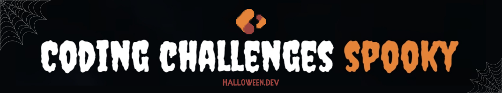

My solutions for the spooky coding challenges over at **[Halloween.dev](https://halloween.dev) _(2024 edition)_**, by [@midudev](https://midu.dev). If you know Javascript or Typescript, go and challenge yourself as well and give the project some love! 🧡

> [!IMPORTANT]
> **This repository is a work in progress.**

 Added all my initial solutions for each challenge in JavaScript  
 Refactored the initial solutions until I'm _moderately_ happy with them
 Added the solutions for each challenge in TypeScript

👇🏻 [Changelog](#changelog)

| #   | Challenge Title                                        |  |  |
| --- | ------------------------------------------------------ | --------------------------------------------------------------------------------------------------------------------------------------------------------------------------------------------------------------------------------------------- | ------------------------------------------------------------------------------------------------------------------------------------------------------------------------------------------------------------------------------------- |
| 01  | [🧙‍♀️ Create the Perfect Potion](01/challenge01.md)      | [01](01/challenge01.js)                                                                                                                                                                                                                       | TBA                                                                                                                                                                                                                                   |
| 02  | [🧟 Zombie Horde](02/challenge02.md)                   | [02](02/challenge02.js)                                                                                                                                                                                                                       | TBA                                                                                                                                                                                                                                   |
| 03  | [🛌🏻 Escape from Freddy's Nightmare](03/challenge03.md) | [03](03/challenge03.js)                                                                                                                                                                                                                       | TBA                                                                                                                                                                                                                                   |
| 04  | [🔪 Find the Killer](04/challenge04.md)                | [04](04/challenge04.js)                                                                                                                                                                                                                       | TBA                                                                                                                                                                                                                                   |
| 05  | 🔺 Terror on Pyramid Head                              | TBA                                                                                                                                                                                                                                           | TBA                                                                                                                                                                                                                                   |

### Changelog

- **October 30th** created the repo and posted the JavaScript solutions for challenges 1,2,3,4
